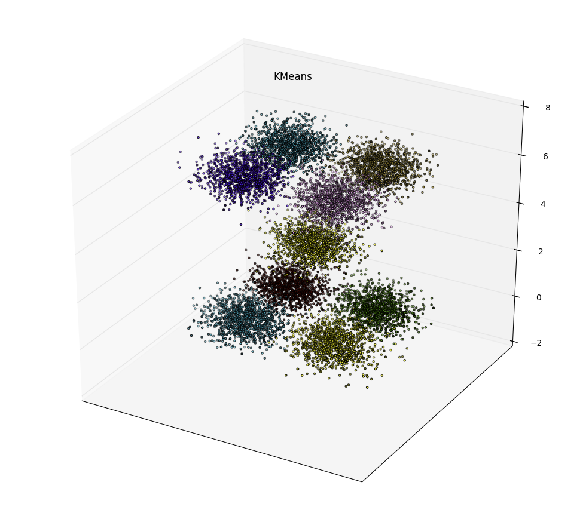
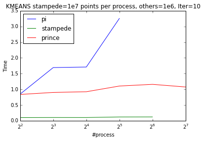
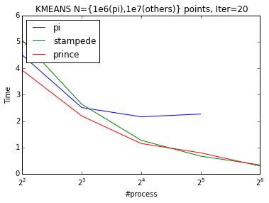
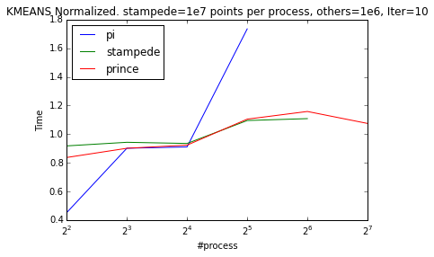
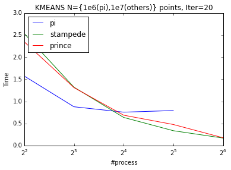

# Algorithm Details
K-means is an iterative clustering algorithm, which returns the cluster center given data and #clusters. Openmpi is a message parsing library used for parallel implementations. K-means minimizes the square loss between cluster center and each point belonging to that cluster. We shared the data between processes evenly and decided to communicate the errors to each process at each iteration, such that at the end every process calculates the new clusters. Doing that we have a communication cost in the order of O(cp), where c is total number of clusters and p is total number of processes. The algorithm works as follows:

1. Range based data partition. Each process reads its own part from the file system.
2. P0 picks initial centers by sampling random point from the data.
3. For 1:N
    a. Each process calculate closest cluster center for each point and accumulates the residual for each center. We hold the sum of residuals and count of points belonging to that cluster separately to reduce the communication and to be be able to calculate the new centers effortlessly .
    b. Share residual sum & counts by using `AllReduce`. 
    c. Each process calculates new centers by summing the individual residual sums together and dividing the result by the total count of that cluster (number of points belonging to that cluster)

# Running mpi-code 
We wrote a python script to generate random points sampled from normal distribution around 9 different points with 0.5 standard deviation. Visualization of a small dataset sampled provided below. The centers are at {(1,-1,0), (1,1,0),(-1,-1,0),(-1,1,0),(0,0,3),(1,-1,6), (1,1,6),(-1,-1,6),(-1,1,6)}.

 

```python
python create_data.py 10000 points.dat
```

After running `make` to compile c-code one can run openmpi code with
```
mpirun -np 4 ./k_means 3 10000 9 points.dat 30
#3d data,Total: 10000 points,2500 points per process from file points.dat
#Center 0 from line 73
#...
#centers:
#-0.967202 0.981146 -0.044941 
#....
#Time elapsed is 0.022455 seconds.
```

where `k_means <dimension of a point> <N> <#clusters> <datafile> <#iterations>`. 

# Results
I run the openMPI code on the Raspberry Pi-cluster we created and on some big clusters like NYU’s Prince and TACC’s Stampede. I investigated weak and strong scaling on up to 256 nodes. Pi-cluster doesn’t show good weak scaling (from 4 process to 8) and we believe that this behavior is due to the shared resources. From 8 process to 16 pi scales perfectly. K-means scales almost perfectly in Stampede and Prince. 

| Weak Scaling | Strong Scaling |
| ------------ | -------------- |
|  | |

To be able observe the scaling behaviour better between processes we can normalize the timings by dividing it to their mean value. 

| Weak Scaling | Strong Scaling |
| ------------ | -------------- |
|  | |